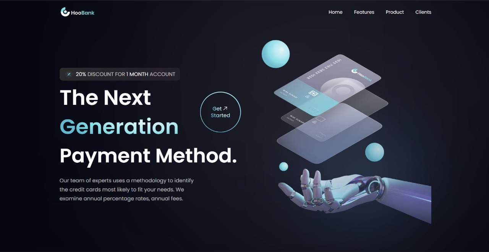

<p align="center">
  
</p>

A sleek, modern banking app landing page designed to showcase financial services, features, and client testimonials—all built with React and deployed on Netlify.

##  Demo

Check it live here: https://hoobankingonline.netlify.app/
<p align="center">
  <a href="https://hoobankingonline.netlify.app/">
    
  </a>
</p>


---

##  Features

- Intuitive, responsive layout with sections such as Home, Features, Product, Clients  
- Engaging hero banner: **"The Next Generation Payment Method"**  
- Highlighted key stats:
  - 3,800+ active users  
  - 230+ trusted companies  
  - $230M+ in transactions  
- Trust-boosting highlights: **Rewards**, **100% Secured**, **Balance Transfer**  
- Clear “Easily control your billing & invoicing” section  
- Client testimonials to build user confidence  
- Persistent “Get Started” call-to-action buttons  
- Footer with **Useful Links**, **Community**, **Partner** sections and social media icons  

---

##  Tech Stack

- **Framework**: React (likely created with Vite)  
- **Styling**: Tailwind CSS — inferred from utility-based styling patterns  
- **Deployment**: Hosted on Netlify with CI/CD setup for automatic builds :contentReference[oaicite:2]{index=2}

---

##  Installation & Local Setup

1. **Clone the repository:**
    ```bash
    git clone https://github.com/ss-saksham/HooBank.git
    cd HooBank
    ```
2. **Install dependencies:**
    ```bash
    npm install
    ```
3. **Run the development server:**
    ```bash
    npm run dev
    ```
4. **Visit locally** at `http://localhost:3000` (default for Vite).

---

##  How It Works

1. The homepage features a hero section that introduces the app.
2. The **Features** section highlights core services like Rewards and Security.
3. **Statistics** showcase user trust and scale.
4. Testimonials add credibility.
5. “Get Started” buttons encourage user engagement.
6. A structured footer consolidates navigation and social links.

---

##  Contributing

Contributions are welcome! Please:
- Fork the repository
- Create a new branch for your feature or fix
- Submit a Pull Request — I’ll review and merge!
- Keep the existing style and patterns consistent

---

##  License

This project is open-source—consider adding an **MIT License**, if that’s your preference. Let me know if you’d like help adding one!

---

##  Acknowledgments

Inspired by the modern UI/UX “HooBank” template, this project combines React and Tailwind CSS for a polished and responsive design.

---

## Optional Additions You Could Include

- **Screenshots or GIFs** of the live site for visual context
- **Badges** for Build Status, License, or Netlify deployment
- **Advanced Scripts**: If you have build or deploy scripts like `npm run build` or `npm run deploy`
- **Contact Info** for feedback or collaboration inquiries

---


